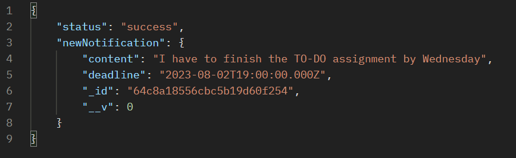
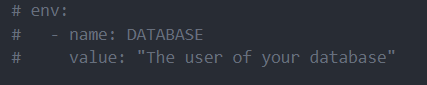
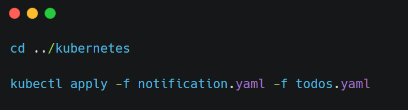
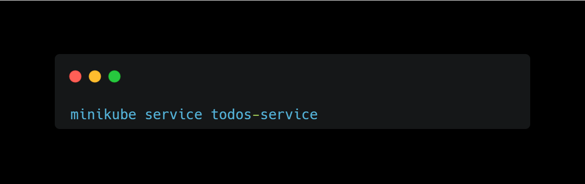
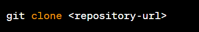
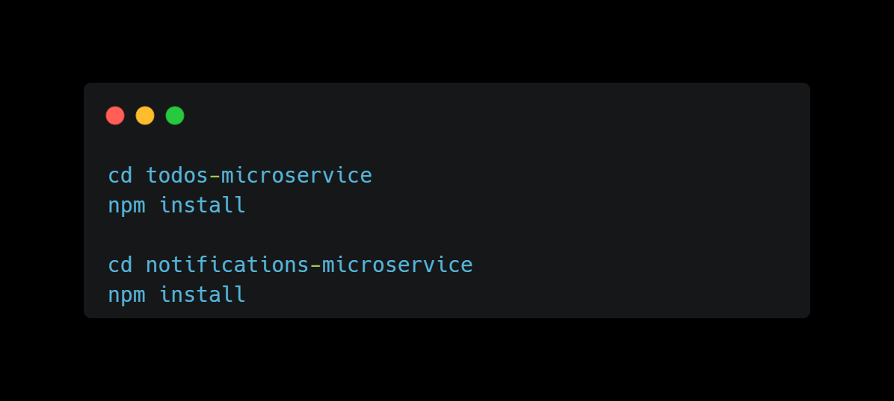
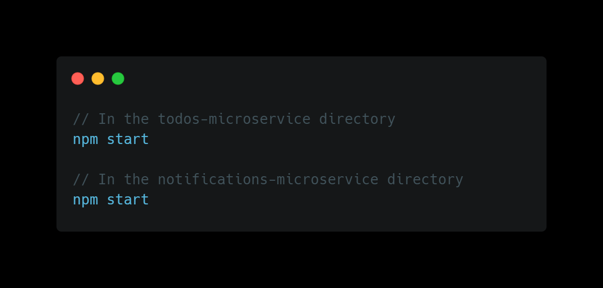

# TO-DOs Web Application - Backend Readme

## Overview

This repository contains the backend implementation of a TO-DOs web application using a microservices architecture with Node.js and MongoDB.
The application consists of two separate microservices - one for managing todos and another for handling notifications.

## Assumptions

1. Since there is no mention of user authentication, we assume that there is only a single user for this application.
2. The "sendNotification()" method is already implemented, and we only need to implement the logic for when to trigger notifications based on todo deadlines.

## System Architecture

The backend is built on a microservices architecture to ensure scalability, maintainability, and separation of concerns. The architecture consists of two main components:

## Todos Microservice

This microservice is responsible for managing todo notifications. It handles the CRUD operations for todos and stores them in the MongoDB database. The todos data structure could look something like this:

- 

The Todos Microservice will run on port 8080.(you can change the ports as needed).

## Notification Microservice

This microservice is responsible for scheduling a reminder to be sent before the deadline expires. It takes the information from MongoDB by querying only the reminders that are in the time range from now to another hour ahead.
The Notifications Microservice will run on port 8000. (you can change the ports as needed)

## How to Run

To run the backend of the TO-DOs web application, follow these steps:

1. Set up the MongoDB database:
   Change the private database according to your user in the notification.yaml, todos.yaml documents

- 

2. Install dependencies for both microservices, and do Kubernetes deployment:

- 

3.  Take Url from todos-microservice to front and use RestAPI with axios:

- 

- 

## How to Run without a Kubernetes

To run the backend of the TO-DOs web application, follow these steps:

1. Clone the git repository:

-

2. Install dependencies for both microservices:

-

3. Set up the MongoDB database:

4. Start the microservices:

-
